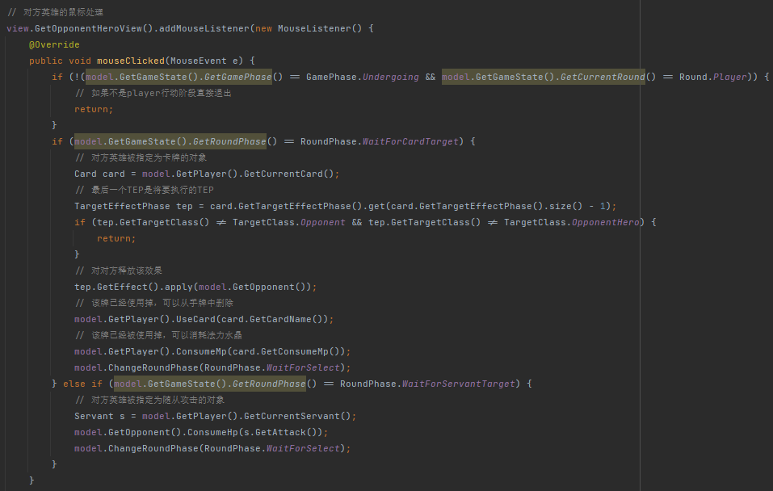

# 简易炉石传说

Java程序设计报告——作业五

2022-2023学年秋冬学期

[TOC]

## 引言

### 设计目的

我想要做一款简易的炉石传说，起因是暴雪和网易没有续约代理，导致炉石传说、守望先锋等众多暴雪游戏将在1月23日退出中国市场。我也算得上是个暴雪游戏的深度玩家，炉石传说是我第一款爱上的游戏，守望先锋是第二款，所以希望在这个特殊的时间点，做一款简易的炉石，致敬青春。

### 设计说明

无奈本学期时间紧迫，同时考试后还有3项大作业，另外swing的图形效果我也不敢恭维，最终呈现的效果只能说差强人意。简单说，实现了多人联机，实现对战的基础功能，有较多卡牌的效果没来得及实现但已经预留较好的接口，UI部分不够美观和便于操作。

代码包含两个项目，分别是`Hearthstone`和`Hearthstone-server`，两者都使用maven架构，前者是客户端使用较明晰的MVC架构，可拓展性较好，后者架构相对糅杂，未来需要重构，或者使用成熟后端框架。

由于使用maven构建，因此只需要在两个文件夹下执行`maven package`即可在`target`目录下生成可执行的`jar`包，在`target`文件夹下执行`jar`包的指令是`java -jar -Dfile.encoding=GBK -jar ./Hearthstone-1.0-SNAPSHOT.jar`。

先执行`server`程序，然后再启动两个`client`程序，即可。`server`使用的IP地址和端口是`localhost:80`，`client`程序也是直接连接到本地80端口。

## 总体设计

### 客户端

#### MVC

采用MVC架构，其中Model独立存在，View和Controller中包含同一个Model，Controller中包含View。首先，Controller负责处理用户的输入（本游戏只有鼠标），Controller给View中的组件添加鼠标事件监听器（和处理函数），当用户的点击触发View上的鼠标监听器时Controller就会修改Model中的数据；Model存储各类数据结构，Model的数据上有View的监听器，当Model的数据改变的时候会触发事件导致View发生改变；View负责给Model中的数据添加监听器（和处理函数）。

因此总体流程是：用户点击View上的组件，触发Controller的鼠标监听函数，Controller修改Model的数据，触发Model数据改变事件，接着触发View对Model的监听函数，导致View发生改变。

#### 网络

客户端和服务器的通信完全放在Model部分。如果在Player阶段，当Model的数据发生修改的时候，客户端会将数据修改发送给服务器；如果在Opponent阶段，客户端会等待服务器发来的指令，并将Model的内容进行修改（这会导致View的变化）。

客户端一般都会新开一个线程来处理和网络的通信，此时存在一些多线程问题，Swing可以用`SwingUtilities.InvokeLater`等函数处理多线程GUI问题。

### 服务器端

服务器端是比较常见的SocketServer架构，服务器监听一个端口（本项目是80），当有客户端连接的时候就记录该客户端的socket，当有两个以上客户端连接的时候，就可以开始一场对局，通过从一个客户端中读取数据并处理，然后交给另一个客户端执行达到两台客户端交互的效果。

## 详细设计

### 客户端

#### Model

##### Card

记录卡牌的名称、卡牌原画地址、卡牌的效果、卡牌消耗的MP，另外还有两个子类：随从牌和法术牌，这里可以主要介绍效果的实现：

此处维护了一个`TargetEffectPhase`类，其中包含释放对象、释放效果和释放时机。

最重要的是这个释放效果：

可以看到这里使用了函数式编程，即每个效果都是一个多参数无返回值的函数，后续只要提供函数的操作对象和操作数作为参数即可使用，这里我已经实现了扣血和回血两种效果，其他有时间也可以再丰富。

##### GameState

`GameState`中有三种全局state，分别是GamePhase、Round、RoundPhase，分别表示不同粒度的对局状态：

GamePhase有关闭、等待对手、对战进行中、对手赢、本人赢。

Round有未开始、本人阶段、对手阶段。

RoundPhase有：无阶段、等待鼠标选择、等待卡牌对象、等待英雄技能对象、等待随从对象。

##### Target

`Target`是一个主类，它表示可选的对象，它的子类有`Player`、`Opponent`、`Servant`。当这三个类内容发生改变的时候会触发事件让View发生改变，另外也会在适当时间向服务器报告它内容的改变。

##### Model

最重要的Model，其中包含了GameState和Target中的两种即Player和Opponent。

同时它还负责与服务器的交互：

#### View

View我使用GridBagLayout，但是这种Layout使用起来并不方便，最后的效果也不算好看。我是分成`5*6`的方格，然后在里面填充不同的部分，例如卡牌区、随从区、英雄信息区等。

这里重点介绍View对Model数据改变的监听函数。

Player数据监听：

Opponent数据监听：

GameState数据监听：

Servant数据监听：

里面都是当Model数据改变的时候，就会触发Update函数，注意两个点：

1. 这些Listener都使用Swing的多线程`invokeLater`，否则会出现画面崩坏
2. 由于GridBagLayout的效果很差，但是我没时间改，最后只能动态添加组件，例如下图，可以看到了先`removeAll`然后添加，最后再重新显示。

另外为了实现背景图片效果，这里重写了JPanel的paintComponent函数：

#### Controller

Controller负责获取鼠标，然后对Model进行修改：

GamePhase转移：

卡牌使用：

对方英雄点击：

结束按钮点击：

友方随从点击：

敌方随从点击：

### 服务器端

Server类负责开始对局：

Game类负责具体的对战逻辑：

状态初始化：

每个Round的对战逻辑：

转发client的消息给另一个client：

## 测试与运行

点击开始匹配：

等待匹配：

游戏初始化：

游戏画面：

## 总结

主要还是由于时间问题，没有完美地实现出一开始的目标，但是也许从零到一分的过程比从一分到一百分的过程更加重要。在做这个项目的过程中，我最大的收获是学会了maven和MVC，这两个架构方法让我的项目非常清晰而且可扩展性很高，项目的编译构建也很方便，同时我还用到了Java的函数式编程（刚好本学期学了PPL），还学到了Event-Listener模式，写的过程中一遍一遍重构代码的感觉非常舒服。最后还是衷心希望不在乎中国玩家的暴雪永远不要再回归中国，我的青春到此为止。

## 参考文献

无